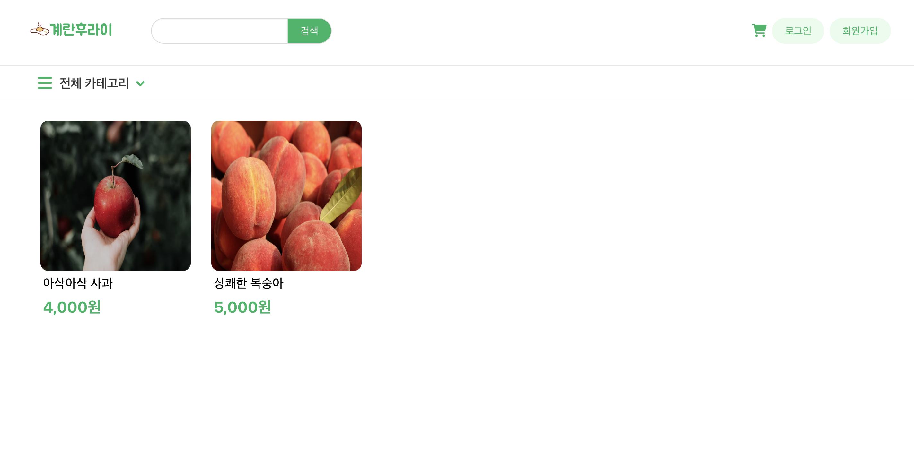
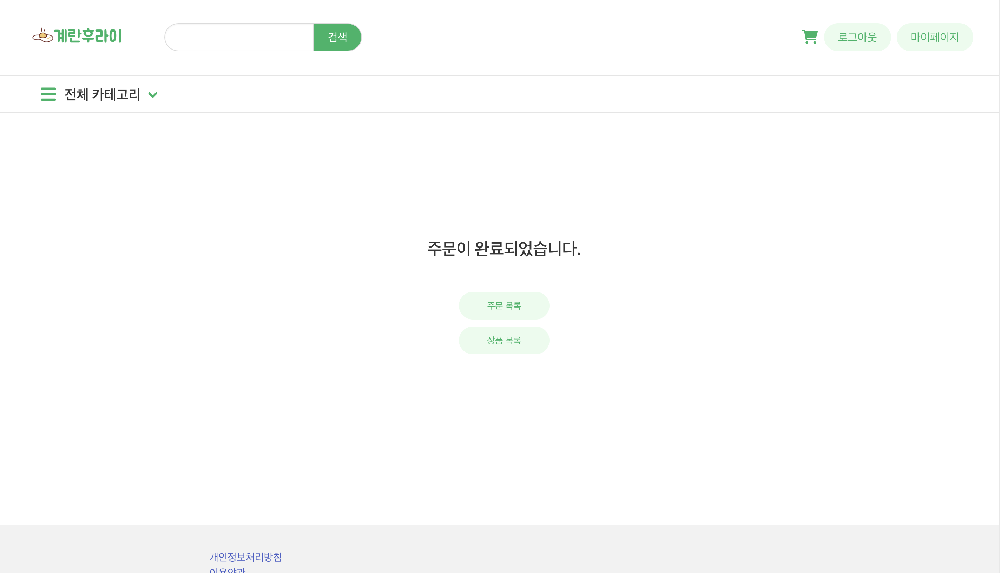
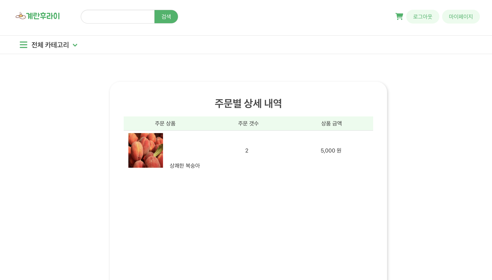
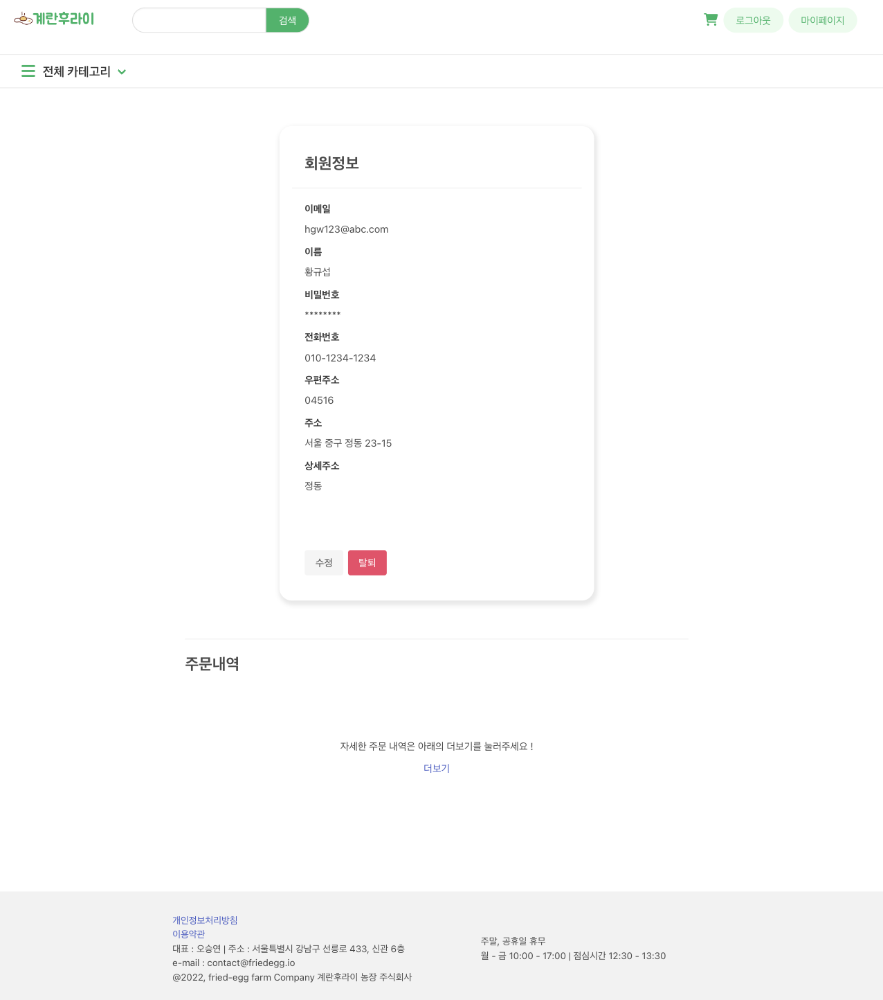
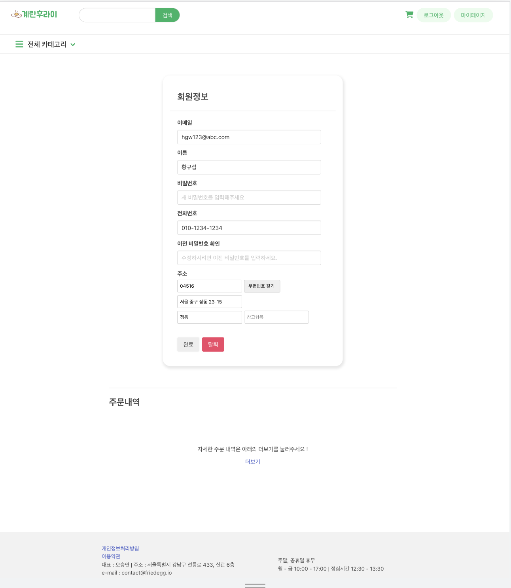
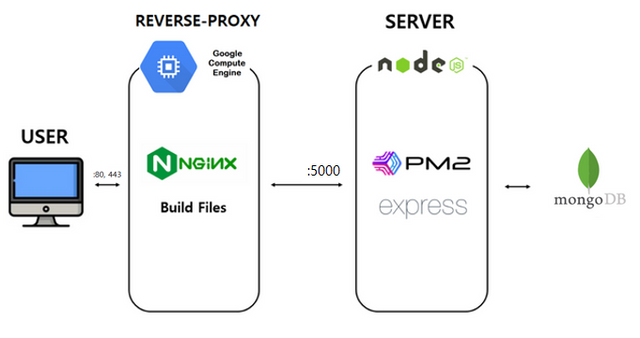

# 농산물 쇼핑몰 웹서비스

<div align='center'>


</div>

<br />

## 서비스 링크

> http://kdt-sw3-team14.elicecoding.com/

#### 테스트 계정

- 일반 유저
  - ID: root@root.com
  - PW: 1234
- 관리자
  - ID: admin@admin.com
  - PW: 1234
    <br />

## 프로젝트 소개

#### 관리자가 제품과 카테고리를 관리할 수 있고 사용자는 제품에 접근할 수 있으며, 장바구니 추가, 주문하기 등이 가능합니다.

1. 사용자는 회원가입, 로그인을 할 수 있고, 마이페이지를 통해 회원정보 수정 및 탈퇴 등 사용자 관련 CRUD를 할 수 있습니다.
2. 관리자 페이지가 있습니다. 여기서 관리자가 제품, 카테고리 그리고 회원 주문 정보에 CRUD 기능을 수행하며 관리할 수 있습니다.
3. 장바구니 관련 기능을 프론트 단에서 수행할 수 있습니다.
4. 일반 사용자는 제품과 카테고리에 대해 관리자의 CRUD 기능으로 접근할 수는 없지만 정보를 조회할 수 있습니다. 조회한 정보를 바탕으로 장바구니와 주문을 생성할 수 있습니다.

<br />

### :page_facing_up: 페이지 별 화면

|                                        |                                     |
| -------------------------------------- | ----------------------------------- |
|               |        |
| 메인 페이지                            | 회원가입 화면                       |
|              |       |
| 로그인 페이지                          | 카테고리별 제품 목록 페이지 (과일)  |
|     |          |
| 카테고리별 제품 목록 페이지 (채소)     | 제품 상세 페이지                    |
|               |           |
| 장바구니 페이지                        | 주문 페이지                         |
|      |      |
| 주문완료 페이지                        | 주문내역 페이지                     |
|        |                                     |
| 주문상세페이지                         |                                     |
|              |    |
| 마이페이지                             | 수정 페이지                         |
|              |  |
| 관리자 관리 페이지                     | 상품 관리                           |
|  |                                     |
| 상품 수정 페이지                       |                                     |
|     |     |
| 관리자 카테고리 관리 페이지            | 관리자 주문 관리 페이지             |

<br />

## :hammer_and_wrench: 기술 스택


### 프론트엔드

- EJS
- BULMA
- Swiper
- CKeditor
- Daum 도로명 주소 API
- Fontawesome

### 백엔드

- Express JS
- mongoDB, mongoose
- express-validator
- Joi
- Multer, Cloudinary, Multer-Storage-Cloudinary
- Jest

### Deploy

- NGINX
- PM2

<br />

## :green_book: 아키텍처

<br />

  <br />

## 제작자

| 이름   | 담당 업무       |
| ------ | --------------- |
| 오승연 | 팀장/프론트엔드 |
| 신현규 | 백엔드          |
| 이도연 | 프론트엔드      |
| 정지영 | 프론트엔드      |
| 황규섭 | 백엔드          |

## 멤버별 Responsibility

### 1. 오승연 : 팀장/프론트엔드 담당

- 메인, 상품 목록, 상세 페이지, 관리자 카테고리 페이지 구현
- 헤더 컴포넌트 분리

### 2. 신현규 : 백엔드 담당

- 주문관련 API 구현
- 테스트 코드 작성 및 배포

### 3. 이도연 : 프론트엔드 담당

- 회원 정보 관리, 관리자 페이지, 주문 내역 조회 및 관리, 에러 페이지 구현
- 푸터 컴포넌트 분리

### 4. 정지영 : 프론트엔드 담당

- 장바구니, 주문, 관리자 상품 및 주문 페이지 구현
- 모달 컴포넌트 분리

### 5. 황규섭 : 백엔드 담당

- 상품 및 카테고리 API 구현
- multer와 cloudinary로 파일 업로드 기능 구현

<br />

## :runner: 로컬 실행 방법

1. 레포지토리를 클론하고자 하는 디렉토리에서 아래 명령어를 수행

   ```
   git clone <레포지토리 주소>
   ```

<br>

2. 클론한 디렉토리에서 backend 디렉토리로 들어가 아래 명령어를 통해 backend에서 필요한 module 설치

   ```
   npm install
   ```

<br>

3. backend에서 필요한 `.env` 설정

- 아래 설명에 따라 환경변수 설정

  ```
  MONGODB_URL=<몽고DB URL>
  PORT=5000
  JWT_SECERT_KEY=<랜덤 문자열>
   NODE_ENV="dev"
   CLOUDINARY_CLOUD_NAME=<CLOUDINARY_ID>
   CLOUDINARY_KEY=<CLOUDINARY_KEY>
   CLOUDINARY_SECRET=<CLOUDINARY_SECRET>

  ```

앱을 테스트하고 싶은 경우 다음의 몽고DB URL을 이용하세요.

- `mongodb+srv://vegetable:<비밀번호>@vegetable.uoxspel.mongodb.net/vegetable?retryWrites=true&w=majority`
  <br>

4. express 앱을 실행

   ```
   npm run start
   ```

<br>

## API Postman URL

- https://documenter.getpostman.com/view/23999077/2s8YRmJXwV

## API 테스트

```
npm run test
```
